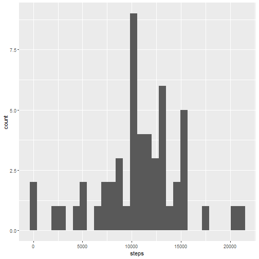
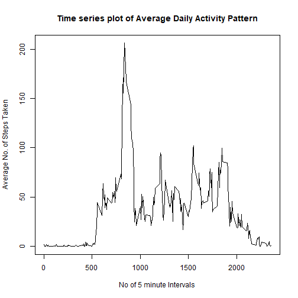
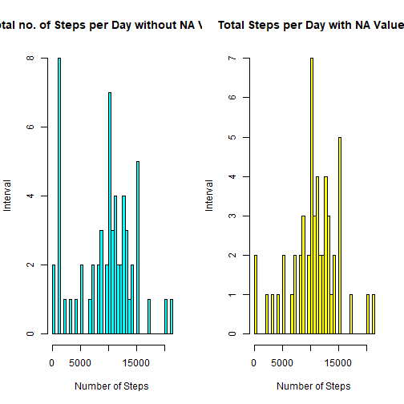
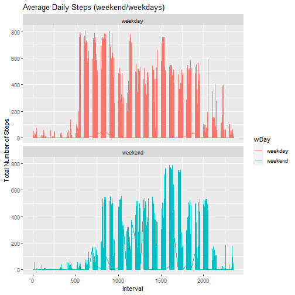

```r
###Loading and preprocessing the data

#Loading the data i.e. the Activity Dataset, using read.csv

activity <- read.csv("activity.csv")

#Processing the data (if necessary) into a format suitable for analysis

activity_processed <- table(activity, dnn = "date")
#######################################################################

###What is mean total number of steps taken per day?

#total number of steps taken per day

total_steps_per_day <- aggregate(steps~date, data = activity, FUN = sum)

#histogram of total number of steps taken each day

library(ggplot2)
ggplot(total_steps_per_day, aes(x=steps)) + geom_histogram()
```

```
## `stat_bin()` using `bins = 30`. Pick better value with `binwidth`.
```



```r
#Mean and Median of total number of steps taken per day
Mean_of_steps <- mean(total_steps_per_day$steps)
Median_of_steps <- median(total_steps_per_day$steps)
#######################################################################

###What is the average daily activity pattern?

#5-minute interval (x-axis) and the average number of steps taken,
interval_five <- aggregate(steps~interval, data = activity, FUN = mean)

# time series plot
plot(x = interval_five$interval, 
     y = interval_five$steps, 
     type = "l", 
     #col = "orange",
     xlab = "No of 5 minute Intervals",
     ylab = "Average No. of Steps Taken",
     main = "Time series plot of Average Daily Activity Pattern")
```



```r
# Which 5 min interval contains the maximum number of steps?
maximum_steps <- interval_five$interval[which.max(interval_five$steps)]
#######################################################################

###Imputing missing values

#Calculating total no. of missing values
count_NA <- sum(is.na(activity$steps))

#filling in all of the missing values in the dataset
activity_new <- activity
nas <- is.na(activity_new$steps)
avg_interval <- tapply(activity_new$steps, activity_new$interval, median, na.rm=TRUE, simplify = TRUE)
activity_new$steps[nas] <- avg_interval[as.character(activity_new$interval[nas])]
names(activity_new)
```

```
## [1] "steps"    "date"     "interval"
```

```r
#activity2 <- activity
#activity2$steps[is.na(activity2$steps)]<-median(activity2$steps,na.rm=TRUE)

#Create a new dataset that is equal to the original dataset but with the missing data filled in
activity_Imputed <- activity_new

# Making of Histogram
par(mfrow=c(1,2)) #(Increasing number of column)
total_steps_per_day_new <- aggregate(steps ~ date, data = activity_new, FUN = sum, na.rm = TRUE)
mean_total_steps_per_day_new <- mean(total_steps_per_day_new$steps)
median_total_steps_per_day_new <- median(total_steps_per_day_new$steps)

# Histogram without the NA values
hist(total_steps_per_day_new$steps, 
     main = "Total no. of Steps per Day without NA Values", 
     xlab = "Number of Steps", 
     ylab = "Interval",
     col="cyan",
     breaks=50)

# Histogram with the NA values
hist(total_steps_per_day$steps, 
     main="Total Steps per Day with NA Values", 
     xlab="Number of Steps", 
     ylab = "Interval",
     col="yellow",
     breaks=50)
```



```r
# Impact

s1 <- summary(total_steps_per_day)
s2 <- summary(total_steps_per_day_new)

##########################################################################

library(knitr)
library(dplyr)
```

```
## 
## Attaching package: 'dplyr'
```

```
## The following objects are masked from 'package:stats':
## 
##     filter, lag
```

```
## The following objects are masked from 'package:base':
## 
##     intersect, setdiff, setequal, union
```

```r
# Are there differences in activity patterns between weekdays and weekends?
# Create a new factor variable in the dataset with two levels - "weekday" and "weekend"

activity_Imputed$date <- as.Date(activity_Imputed$date)
#creating a vector of weekdays
weekdays1 <- c('Monday', 'Tuesday', 'Wednesday', 'Thursday', 'Friday')
activity_Imputed$wDay <- c('weekend', 'weekday')[(weekdays(activity_Imputed$date) %in% weekdays1)+1L]


ggplot(activity_Imputed, aes(x =interval , y=steps, color=wDay)) +
  geom_line() +
  labs(title = "Average Daily Steps (weekend/weekdays)", x = "Interval", y = "Total Number of Steps") +
  facet_wrap(~ wDay, ncol = 1, nrow=2)
```



